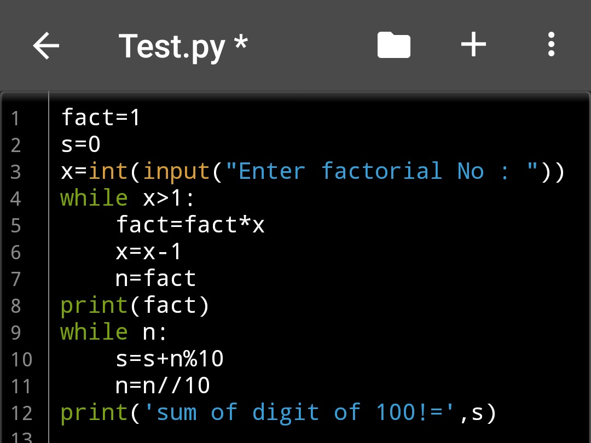

# Assigment
**1. WAP to find those numbers which are divisible by 7 and multiple of 5, between 1500 and 2700 (both included)**

Code:

Output :

**2. WAP to count the number of multiples 3 between 10-100**

Code:

Output:

**3. Sum of digits of n!: n! means nx (n 1) ... 3 x 2 x 1. For example, 10! 10 x 9 x x 3 x 2 x 1 = 3628800 and the sum of the digits in the number 10! is 3 6 2 8 8+0+0 27. Find the sum of the digits in the number 100!.**

Code:

Output:

**4. Sum square difference: WAP to find the difference between the sum of the squares of the first ten natural numbers and the square of the sum of the first ten natural numbers**.

Code:

Output:

**5. Smallest divisible no.: Find the smallest number that can be divided by each of the numbers from 1 to 10 without any remainder.**

Code:

Outlut:

**6. Largest Prime Factor: The prime factors of 13195 are 5, 7, 13 and 29. What is the largest prime factor of the number 600851475143**

Code:

Output:

**7. Multiples of 3 and 5: If we list all the natural num bers below 10 that are multiples of 3 or 5, we get 3, 5, 6 and 9. The sum of these multiples is 23. Find the sum of all the multiples of 3 or 5 below 1000**

Code:

Outlut:

**8. Fibonacci series: Print 10th even number in Fibonacci series.**

Code **:**

Output:

